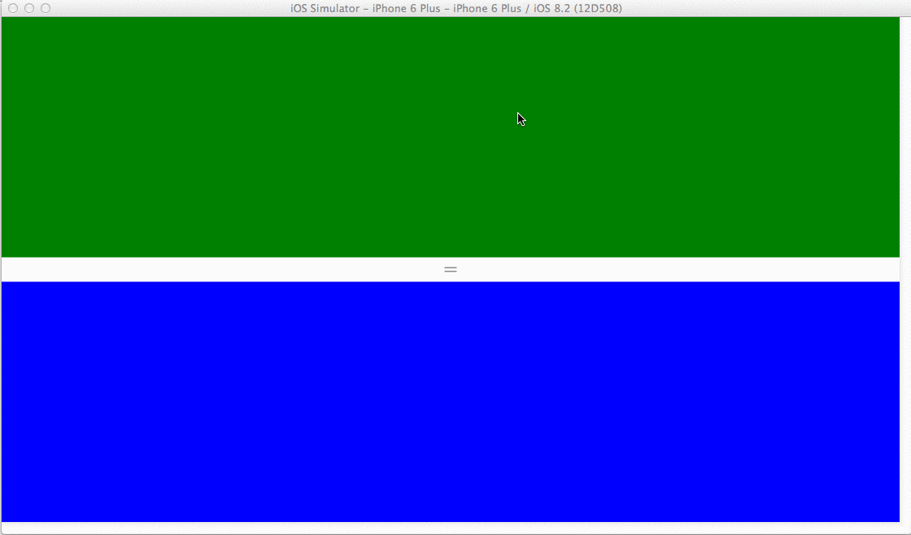
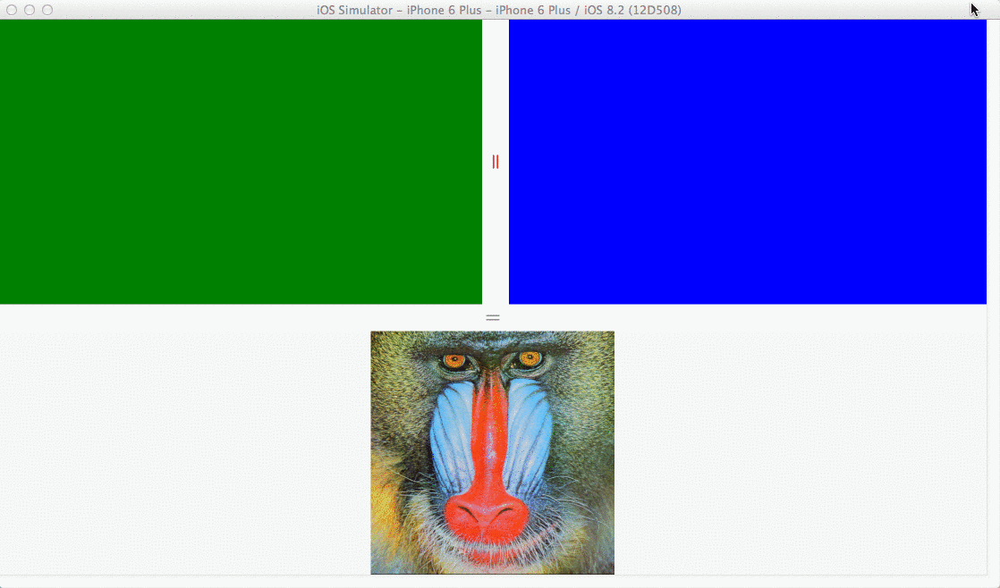

GridSplitter control for Xamarin Forms
===================

A control for <b>Xamarin Forms</b> that redistributes space between columns or rows of a <b>Grid</b> control.

At this moment the implementation is for <b>Android</b> and <b>iOS</b>. Contributions for Windows support are welcome!

Usage
-------

An example of a Grid with two rows and a GridSplitter control:

          <?xml version="1.0" encoding="UTF-8"?>
          <ContentPage xmlns="http://xamarin.com/schemas/2014/forms"
          	           xmlns:x="http://schemas.microsoft.com/winfx/2009/xaml"
          	           x:Class="GridSplitterApp.TestPage"
          	           xmlns:controls="clr-namespace:GridSplitterApp.Controls;assembly=GridSplitterApp">
          	<Grid RowSpacing="0">
          		<Grid.RowDefinitions>
          			<RowDefinition />
          			<RowDefinition Height="Auto" />
          			<RowDefinition />
          		</Grid.RowDefinitions>
          		<BoxView BackgroundColor="Green" />
          		<controls:GridSplitter Grid.Row="1"
          		                       VerticalOptions="Center" />
          		<BoxView BackgroundColor="Blue"
          			       Grid.Row="2" />
          	</Grid>
          </ContentPage>

Note that `<controls:GridSplitter Grid.Row="1" VerticalOptions="Center" />` tells the GridSplitter control it should resize the adjancent rows.

And here's the result on iOS for the XAML above:

If you would have to split two columns instead, you need to set `HorizontalOptions="Center"` on the GridSplitter:

          <?xml version="1.0" encoding="UTF-8"?>
          <ContentPage xmlns="http://xamarin.com/schemas/2014/forms"
          	           xmlns:x="http://schemas.microsoft.com/winfx/2009/xaml"
          	           x:Class="GridSplitterApp.TestPage"
          	           xmlns:controls="clr-namespace:GridSplitterApp.Controls;assembly=GridSplitterApp">
          	<Grid ColumnSpacing="0">
          		<Grid.ColumnDefinitions>
          			<ColumnDefinition />
          			<ColumnDefinition Width="Auto" />
          			<ColumnDefinition />
          		</Grid.ColumnDefinitions>
          		<BoxView BackgroundColor="Green" />
          		<controls:GridSplitter Grid.Column="1"
          		                       HorizontalOptions="Center" />
          		<BoxView BackgroundColor="Blue"
          			       Grid.Column="2" />
          	</Grid>
          </ContentPage>

An example of two Grid controls each with their own GridSplitter:

Add GridSplitter to your project
-----------------------

1. Add GridSplitter implementation to your Xamarin Forms PCL project 
       [/GridSplitterApp/GridSplitterApp/Controls/GridSplitter.cs](/GridSplitterApp/GridSplitterApp/Controls/GridSplitter.cs)

2. The control uses native renderes. You need to add the renderers to your Android and iOS project respectively:

       [/GridSplitterApp/GridSplitterApp.Droid/Renderers/GridSplitterRenderer.cs](/GridSplitterApp/GridSplitterApp.Droid/Renderers/GridSplitterRenderer.cs)

       [/GridSplitterApp/GridSplitterApp.iOS/Renderer/GridSplitterRenderer.cs](/GridSplitterApp/GridSplitterApp.iOS/Renderer/GridSplitterRenderer.cs)

Note you might need to update some namespaces in your app.
